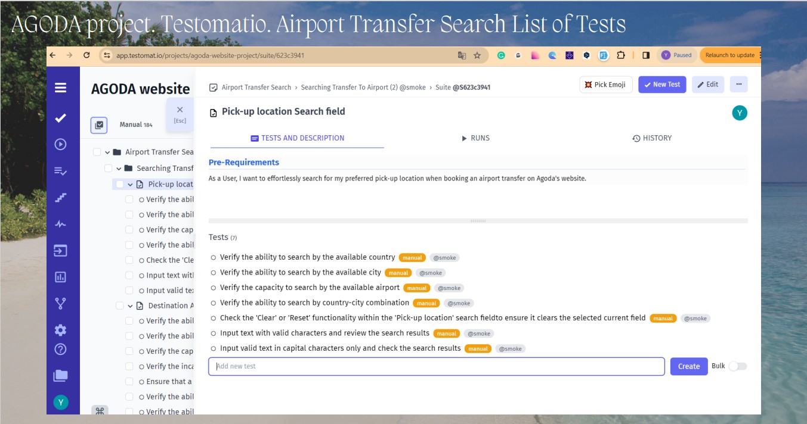
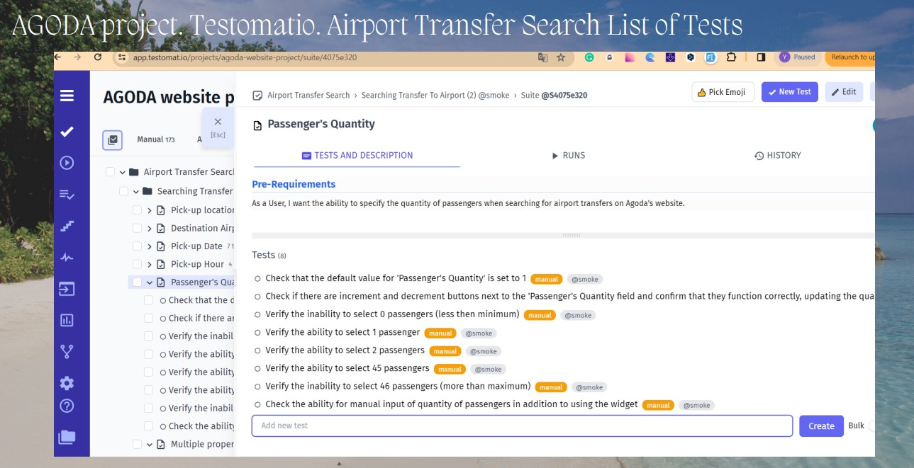

# Testomatio TMS and Jira integration
Manual Software Testing

 

 

## Don't forget to give a :star: to make the project popular :) 

## :boom: The task and what needs to be done?
1. Create test sets in Testomatio.
2. Create a test plan in testomatio.
3. Go to Jira and add Testomatioto Jira.
4. Go to Testomatioin the Jira integration settings and link the Jira project.
5. On the Atlassian website, create an API token and use it to link to Testomatio.
6. QA task: Test Execution, link tests from Testomatio and run the tests through Jira.
7. Generate test report and make a presentation in .pdf format.

 

## :bulb: The result:
1. Test sets have been created in Testomatio.
2. A test plan has been created in Testomatio.
3. Testomatio has been added to Jira in the settings.
4. Jira integration was configured in Testomatio and the Jira project was linked.
5. On the Atlassian website, an API token was created and used for binding in Testomatio.
6. The QA task was completed: Test Execution task, the tests from Testomatio were linked and the wound test was run through Jira.
7. The test report was generated. The result of the work was formalized in the form of a presentation in .pdf format. 

### AGODA Project. Testomatio. Airport Transfer Search List of Tests
 

 

 

### AGODA Project. Jira. Sprint 6. Functional Testing. User Story: Airport Transfer Search Functionality

 

### AGODA Project. Testomatio. Test Plan Creating

 

### AGODA Project. Jira. Test Run

 

### AGODA Project. Testomatio. Test Run Result

 

### AGODA Project. Jira. Bug reports were created after Test Run

 

